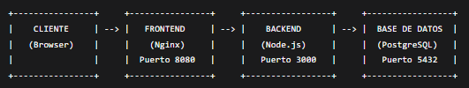

# 📁 Arquitectura del Sistema - TODO App

## 🧭 Diagrama de Arquitectura

## 🧩 Componentes del Sistema

### 1. Frontend (Nginx)
- **Función**: Servir archivos estáticos y actuar como reverse proxy
- **Tecnología**: Nginx Alpine
- **Puerto**: 80 (interno) → 8080 (host)
- **Configuración**: 
  - Sirve archivos HTML, CSS, JavaScript
  - Configuración personalizada en `nginx.conf`

### 2. Backend (Node.js + Express)
- **Función**: API REST para gestión de tareas
- **Tecnología**: Node.js 18 Alpine + Express + pg (PostgreSQL client)
- **Puerto**: 3000
- **Características**:
  - Endpoints CRUD completos
  - Manejo de CORS
  - Conexión a PostgreSQL
  - Validación básica de datos

### 3. Base de Datos (PostgreSQL)
- **Función**: Almacenamiento persistente de tareas
- **Tecnología**: PostgreSQL 15 Alpine
- **Puerto**: 5432
- **Características**:
  - Persistencia mediante volúmenes Docker
  - Health checks automáticos
  - Configuración optimizada para desarrollo

## 🔁 Flujo de Datos

### 📝 Creación de Tarea
1. Usuario ingresa tarea en interfaz web
2. Frontend envía POST a `/tasks` via Fetch API
3. Backend recibe request y valida datos
4. Backend inserta tarea en PostgreSQL
5. Backend retorna tarea creada
6. Frontend actualiza interfaz

### 📄 Lectura de Tareas
1. Frontend carga y realiza GET a `/tasks`
2. Backend consulta todas las tareas en PostgreSQL
3. Backend retorna array de tareas
4. Frontend renderiza lista

### ✏️ Actualización de Tarea
1. Usuario hace click en tarea para toggle
2. Frontend envía PUT a `/tasks/:id`
3. Backend actualiza estado en PostgreSQL
4. Frontend actualiza interfaz visual

### 🗑️ Eliminación de Tarea
1. Usuario hace click en botón eliminar
2. Frontend envía DELETE a `/tasks/:id`
3. Backend elimina tarea de PostgreSQL
4. Frontend remueve elemento de lista

## 🐳 Docker Compose Orquestación

### ⚙️ Servicios Configurados

services:

  db:
  
    image: postgres:15-alpine
    container_name: todo-app-db
    environment:
      POSTGRES_USER: todo_user
      POSTGRES_PASSWORD: todo_password
      POSTGRES_DB: todoapp
    ports:
      - "5432:5432"
    volumes:
      - postgres_data:/var/lib/postgresql/data
    healthcheck:
      test: ["CMD-SHELL", "pg_isready -U todo_user -d todoapp"]
      interval: 10s
      timeout: 5s
      retries: 5
      start_period: 30s
    networks:
      - todo-network

  backend:
  
    backend:
    build: 
      context: ./backend
      dockerfile: Dockerfile
    container_name: backend-app
    environment:
      DB_HOST: db
      DB_PORT: 5432
      DB_USER: todo_user
      DB_PASSWORD: todo_password
      DB_NAME: todoapp
      PORT: 3000
      NODE_ENV: production
    ports:
      - "3000:3000"  
    depends_on:
      db:
        condition: service_healthy
    networks:
      - todo-network

  frontend:
  
    frontend:
    build: 
      context: ./frontend
      dockerfile: Dockerfile
    container_name: frontend-app
    ports:
      - "8080:80"
    depends_on:
      - backend
    networks:
      - todo-network
      
  volumen:
    
    volumes:
      postgres_data:

  networks:
      
      todo-network:
        driver: bridge

## 🌐 Networking

- **Red por defecto:** Docker Compose crea red todo-app_default

- **Comunicación:** Servicios se comunican usando nombres de servicio como hostnames

- **Aislamiento:** Todos los servicios en la misma red bridge

## 💽 Volúmenes

- **Volumen nombrado:** postgres_data para persistencia de base de datos

- **Persistencia:** Datos sobreviven reinicios de contenedores

# 🔐 Consideraciones de Seguridad

### 🔑 Variables de Entorno

- Las credenciales de acceso (usuario, contraseña, nombre de base de datos) se manejan mediante `environment:` en cada servicio.
- No están hardcodeadas en el código fuente, lo que evita filtraciones accidentales.
- Se recomienda separar la configuración por ambiente (`.env` para desarrollo, producción) para mayor control y flexibilidad.

### 🧰 Buenas Prácticas con Docker

- Uso de imágenes **Alpine** para reducir el tamaño de los contenedores y mejorar tiempos de build.
- Inclusión de `.dockerignore` para excluir archivos innecesarios del contexto de build.
- Implementación de **multi-stage builds** para optimizar la imagen final y evitar incluir dependencias de desarrollo.
- Configuración de **health checks** en el servicio `db` para asegurar que el backend solo se conecte cuando la base de datos esté lista.
